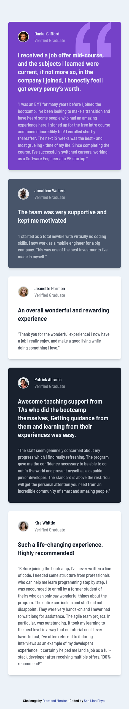
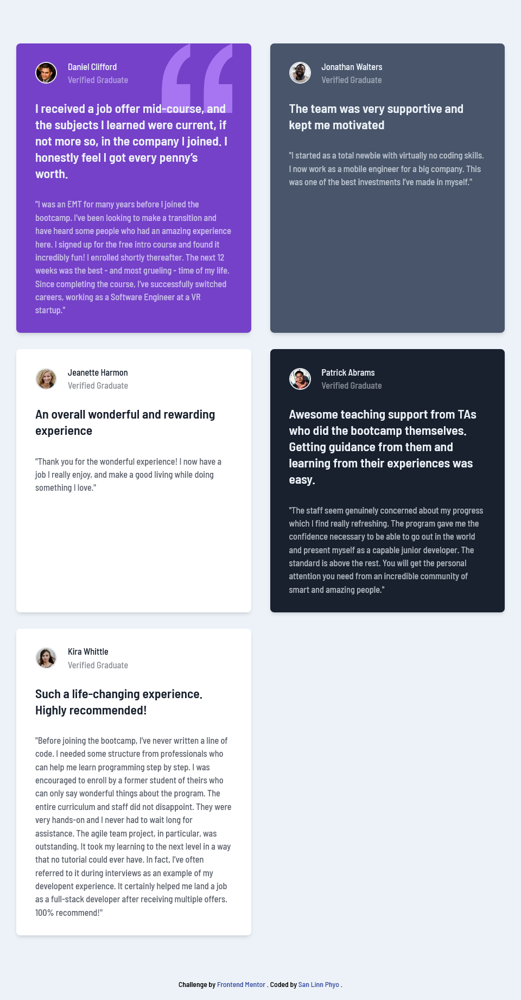
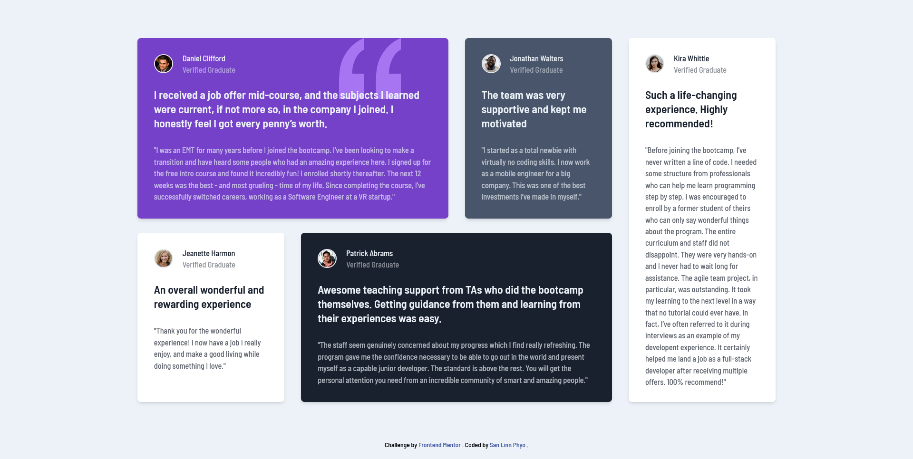

# Frontend Mentor - Testimonials grid section solution

This is a solution to the [Testimonials grid section challenge on Frontend Mentor](https://www.frontendmentor.io/challenges/testimonials-grid-section-Nnw6J7Un7). Frontend Mentor challenges help you improve your coding skills by building realistic projects.

## Table of contents

- [Overview](#overview)
  - [The challenge](#the-challenge)
  - [Screenshot](#screenshot)
  - [Links](#links)
- [My process](#my-process)
  - [Built with](#built-with)
  - [What I learned](#what-i-learned)
  - [Useful resources](#useful-resources)
- [Author](#author)

## Overview

### The challenge

Users should be able to:

- View the optimal layout for the site depending on their device's screen size

### Screenshot

For mobiles

For tablets

For laptops

### Links

- Solution URL: https://github.com/sanlinnphyo1006/testimonials-grid-section
- Live Site URL: https://slpprojects-testimonials-grid-section.netlify.app/

## My process

### Built with

- Semantic HTML5 markup
- CSS Grid
- Mobile-first workflow
- [React](https://reactjs.org/) - JS library
- [Tailwindcss](https://tailwindcss.com/) - For styles

### What I learned

I learned how to use CSS grid.

### Useful resources

- [CSS Grid Crash Course](https://www.youtube.com/watch?v=0xMQfnTU6oo&t=5s) - This helped me in learning CSS grid.

## Author

- Github - [San Linn Phyo](https://github.com/sanlinnphyo1006)
- Frontend Mentor - [@sanlinnphyo1006](https://www.frontendmentor.io/profile/sanlinnphyo1006)
